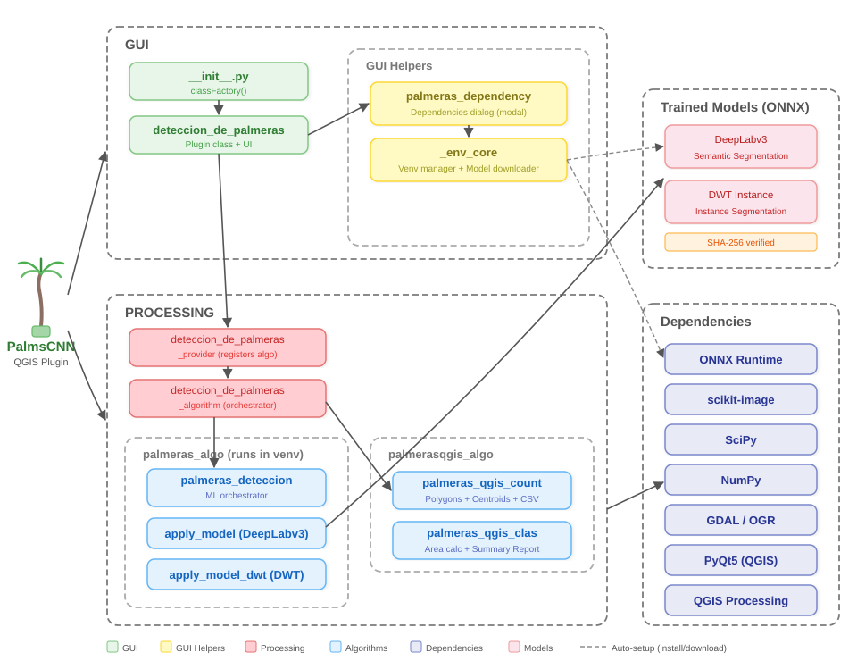

# PalmsCNN Developer Documentation

This document describes the internal architecture, module responsibilities, data flow, and conventions of the PalmsCNN QGIS plugin. It is intended for developers who want to understand, maintain, or extend the codebase.

---

## Table of Contents

1. [Plugin Architecture](#plugin-architecture)
2. [Directory Structure](#directory-structure)
3. [Module Reference](#module-reference)
   - [GUI Layer](#gui-layer)
   - [GUI Helpers](#gui-helpers)
   - [Processing Layer](#processing-layer)
   - [Core Algorithms (palmeras_algo)](#core-algorithms-palmeras_algo)
   - [QGIS Post-processing (palmerasqgis_algo)](#qgis-post-processing-palmerasqgis_algo)
4. [Execution Flow](#execution-flow)
5. [Isolated Virtual Environment](#isolated-virtual-environment)
6. [Trained Models (ONNX)](#trained-models-onnx)
7. [Processing Pipeline Details](#processing-pipeline-details)
   - [Semantic Segmentation](#semantic-segmentation)
   - [Instance Segmentation](#instance-segmentation)
   - [Post-processing and Vectorization](#post-processing-and-vectorization)
8. [Dependencies](#dependencies)
9. [Class and Species Encoding](#class-and-species-encoding)
10. [Adding or Updating Models](#adding-or-updating-models)
11. [Known Limitations](#known-limitations)

---

## Plugin Architecture

<p align="center">
  
</p>

The plugin is organized into four layers:

| Layer | Responsibility |
|-------|---------------|
| **GUI** | QGIS integration: toolbar, menu, plugin lifecycle |
| **GUI Helpers** | Dependency dialog, virtual environment manager, model downloader |
| **Processing** | QGIS Processing Framework provider and algorithm orchestrator |
| **Core Algorithms** | ML inference (runs inside isolated venv) and QGIS-based vectorization |

A key architectural decision is that ML inference runs in an **isolated Python subprocess** (venv) to avoid dependency conflicts between the plugin's libraries (NumPy 2, ONNX Runtime) and QGIS's embedded Python environment.

---

## Directory Structure

```
PalmsCNN-plugin-QGIS/
├── __init__.py                          # Plugin entry point (classFactory)
├── deteccion_de_palmeras.py             # Main plugin class (UI, toolbar, menu)
├── deteccion_de_palmeras_provider.py    # QGIS Processing provider
├── deteccion_de_palmeras_algorithm.py   # Processing algorithm orchestrator
├── _env_core.py                         # Venv manager + model downloader
├── palmeras_dependency.py               # Dependencies dialog (modal)
├── metadata.txt                         # QGIS plugin metadata
├── requirements.txt                     # Python dependencies
├── logo.png                             # Plugin icon
├── palmeras_algo/                       # Core ML modules (run inside venv)
│   ├── __init__.py
│   ├── palmeras_deteccion.py            # ML orchestrator + image diagnostics
│   ├── apply_model.py                   # Semantic segmentation (DeepLabv3)
│   └── apply_model_dwt.py              # Instance segmentation (DWT)
├── palmerasqgis_algo/                   # QGIS post-processing modules
│   ├── palmeras_qgis_count.py           # Polygonize + centroids + attributes CSV
│   └── palmeras_qgis_clas.py            # Classification areas + summary report
├── trained_models/                      # Venv location + ONNX model files
│   └── model_manifest.txt
├── help/                                # Documentation
│   ├── DEVELOPER.md                     # This file
│   └── images/
│       └── architecture.svg
├── test/                                # Unit tests
├── i18n/                                # Internationalization
└── scripts/                             # Utility scripts
```

---

## Module Reference

### GUI Layer

#### `__init__.py`

QGIS calls `classFactory(iface)` when loading the plugin. This function instantiates and returns a `DeteccionDePalmerasPlugin` object.

```python
def classFactory(iface):
    from .deteccion_de_palmeras import DeteccionDePalmerasPlugin
    return DeteccionDePalmerasPlugin(iface)
```

#### `deteccion_de_palmeras.py`

**Class:** `DeteccionDePalmerasPlugin`

Main plugin class that handles:
- `initGui()` — Registers the Processing provider, creates toolbar button and menu entry.
- `run()` — Called when the user clicks the toolbar button. First calls `ensure_dependencies()` to verify the venv exists, then opens the Processing algorithm dialog via `processing.execAlgorithmDialog("Palmeras:Detección de Palmeras")`.
- `unload()` — Removes the provider, toolbar icon, and menu entry.

**Key behavior:** The `run()` method gates execution behind dependency verification. If the venv does not exist, a modal dialog is shown and the algorithm dialog is not opened until the environment is ready.

---

### GUI Helpers

#### `palmeras_dependency.py`

**Class:** `DependenciesDialog(QDialog)` — Modal dialog shown when the venv is missing.

**Function:** `ensure_dependencies(iface) -> bool`
- Returns `True` immediately if the venv already exists.
- Otherwise, shows the `DependenciesDialog` modally.
- The dialog displays a "Prepare environment" button that triggers `EnvCore.numpy2_stack_commands()` followed by `EnvCore.ensure_models()`.
- Installation logs are displayed in real-time via `QPlainTextEdit`.

#### `_env_core.py`

**Class:** `EnvCore` — Manages the isolated virtual environment and model downloads.

**Class:** `_SeqRunner(QObject)` — Runs a list of shell commands sequentially using `QProcess`, emitting log signals after each line of output.

**Key `EnvCore` methods:**

| Method | Description |
|--------|-------------|
| `venv_exists()` | Returns `True` if the venv Python executable exists |
| `find_embedded_python()` | Locates the Python bundled with QGIS (e.g., `apps/Python39/python.exe`) |
| `numpy2_stack_commands()` | Returns the list of commands to create venv and install packages |
| `bridge_osgeo_commands()` | Creates a `.pth` file in the venv so `from osgeo import gdal` works |
| `build_env()` | Returns environment variables dict for subprocess execution |
| `dll_snippet()` | Returns a Python snippet that calls `os.add_dll_directory()` for QGIS DLLs |
| `ensure_models(log_cb)` | Downloads and SHA-256 verifies ONNX model files |
| `make_seq_runner(parent, log_slot)` | Creates a `_SeqRunner` connected to a log widget |

**Venv location:** `<plugin_dir>/trained_models/` — The venv is created inside the `trained_models/` directory, not in the QGIS profile directory.

---

### Processing Layer

#### `deteccion_de_palmeras_provider.py`

**Class:** `DeteccionDePalmerasProvider(QgsProcessingProvider)`

Registers the plugin's algorithm(s) with the QGIS Processing framework.

| Method | Returns |
|--------|---------|
| `id()` | `'Palmeras'` |
| `name()` | `'Palmeras'` |
| `loadAlgorithms()` | Adds `DeteccionDePalmerasAlgorithm` |

#### `deteccion_de_palmeras_algorithm.py`

**Class:** `DeteccionDePalmerasAlgorithm(QgsProcessingAlgorithm)`

This is the main orchestrator. It defines the algorithm's inputs and outputs, and coordinates the entire detection pipeline.

**Inputs (parameters):**

| Constant | Type | Description |
|----------|------|-------------|
| `INPUT_RASTER` | `QgsProcessingParameterRasterLayer` | RGB orthomosaic (.tif) |
| `OUTPUT_RASTER` | `QgsProcessingParameterRasterDestination` | Output classified raster |

**Outputs:**

| Constant | Type | Description |
|----------|------|-------------|
| `OUTPUT_VECTOR` | `QgsProcessingOutputVectorLayer` | Polygon shapefile of palm crowns |
| `OUTPUT_CENTROIDES` | `QgsProcessingOutputVectorLayer` | Centroid points |
| `ATRIBUTOS_CSV` | `QgsProcessingOutputFile` | Attributes table CSV |
| `REPORTE_CSV` | `QgsProcessingOutputFile` | Summary report CSV |
| `NMAURITIA` | `QgsProcessingOutputNumber` | Count of Mauritia flexuosa |
| `NEUTERPE` | `QgsProcessingOutputNumber` | Count of Euterpe precatoria |
| `NOENOCARPUS` | `QgsProcessingOutputNumber` | Count of Oenocarpus bataua |
| `AMAURITIA` | `QgsProcessingOutputNumber` | Area of Mauritia (ha) |
| `AEUTERPE` | `QgsProcessingOutputNumber` | Area of Euterpe (ha) |
| `AOENOCARPUS` | `QgsProcessingOutputNumber` | Area of Oenocarpus (ha) |

**`processAlgorithm()` workflow:**

1. Validates that the venv exists (raises `RuntimeError` if not).
2. Creates a temporary Python script that imports `palmeras_deteccion` and calls `apply_palmeras()`.
3. Spawns a `QProcess` using the venv Python interpreter with environment variables from `EnvCore.build_env()`.
4. Parses JSON output from stdout (last line): `{"out": [raster_path, clas_path], "counts": [mau, eut, oeno]}`.
5. Calls `palmeras_qgis_count.apply_toolsqgis()` for polygon/centroid/CSV generation.
6. Calls `palmeras_qgis_clas.apply_toolsqgis()` for area calculation and summary report.
7. Logs results to the Processing feedback panel.
8. Returns all outputs in a dictionary.

---

### Core Algorithms (`palmeras_algo`)

These modules run **inside the isolated venv** subprocess. They have access to NumPy 2, SciPy, scikit-image, ONNX Runtime, and GDAL (bridged from QGIS).

#### `palmeras_deteccion.py`

**Main function:** `apply_palmeras(INPUT_RASTER, OUTPUT_RASTER) -> (out_raster, out_raster_clas, mau, eut, oeno)`

Orchestrates the full ML pipeline:
1. Runs `diagnostic_image_analysis()` on the input.
2. Calls `apply_model.apply_semantic_segmentation_onnx()` with DeepLabv3.
3. Calls `apply_model_dwt.apply_instance_onnx()` with the DWT model.
4. Renames output files and returns paths + counts.

**Helper functions:**
- `diagnostic_image_analysis(img_path)` — Reads raster metadata and per-band statistics (min, max, mean, std, nodata count).
- `improved_preprocessing(image_data, ...)` — Percentile-based normalization with gamma adjustment (0.8). Scales to [-1, 1].
- `postprocess_mask(mask, min_region_size=30)` — Removes small objects and holes per class using `skimage.morphology`.

#### `apply_model.py`

**Main function:** `apply_semantic_segmentation_onnx(input_file_list, output_folder, model_path, window_radius, internal_window_radius, make_tif, scaling) -> name_saved`

Runs the DeepLabv3 semantic segmentation model:
1. Loads image with `load_and_preprocess_tiff_improved()`.
2. Normalizes using either `scale_image_mean_std()` (mean/std) or `normalize_image_improved()` (percentile-based, default).
3. Creates a sliding window grid: `window_radius=256`, `internal_window_radius=192` (75%).
4. For each column, batches all row windows and runs ONNX inference.
5. Takes `argmax` of model output to get class predictions.
6. Applies `postprocess_segmentation_mask()` to remove noise.
7. Saves georeferenced output with `save_tiff_mask()`.

**Sliding window parameters:**
- Full window: 512x512 pixels (radius 256)
- Internal (output) window: 384x384 pixels (radius 192)
- Overlap: 128 pixels on each side

**Output pixel values:** `0` = background, `1` = Mauritia, `2` = Euterpe, `3` = Oenocarpus.

#### `apply_model_dwt.py`

**Main function:** `apply_instance_onnx(feature_file_list, mask, roi, output_folder, model_path2, window_radius, internal_window_radius, make_tif, make_png) -> (name_saved_final, mau, eut, oeno)`

Runs the DWT instance segmentation model:
1. Loads the original RGB image and the semantic segmentation mask.
2. Converts semantic classes to internal codes (`CLASS_TO_SS`: mauritia=-128, euterpe=-96, oenocarpus=-64).
3. Creates 4-channel input: RGB masked by segmentation + semantic mask channel.
4. Runs ONNX inference per window (not batched).
5. Applies `watershed_cut()` for instance separation using morphological erosion.
6. Calls `process_instances_raster()` to label and count individual palms.
7. Saves with `save_tiff_mask_final()`.

**Sliding window parameters:**
- Full window: 700x700 pixels (radius 350)
- Internal window: 525x525 pixels (75%)

**Output pixel values (Cityscapes encoding):** `15` = Mauritia, `25` = Euterpe, `35` = Oenocarpus.

**Key constants:**

| Constant | Mauritia | Euterpe | Oenocarpus |
|----------|----------|---------|------------|
| `CLASS_TO_SS` | -128 | -96 | -64 |
| `CLASS_TO_CITYSCAPES` | 15 | 25 | 35 |
| `THRESHOLD` | 3 | 1 | 2 |
| `MIN_SIZE` | 500 | 400 | 200 |

---

### QGIS Post-processing (`palmerasqgis_algo`)

These modules run in the main QGIS Python environment (not in the venv). They use QGIS Processing algorithms and core API.

#### `palmeras_qgis_count.py`

**Function:** `apply_toolsqgis(OUTPUT_RASTER, name_mask_clas, mau, eut, oeno) -> (c1, c2, c3, OUTPUT_VEC, OUTPUT_CEN, ATRIBUTOS_CSV)`

Processes the **instance segmentation raster** (pixel values 15/25/35):
1. Runs `gdal:polygonize` to convert raster to vector polygons.
2. Runs `qgis:repairshapefile` to fix geometries.
3. Deletes features with `ID == 0` (background).
4. Adds attribute fields: `CLASE` (int), `ESPECIE` (string), `AREA(m2)` (double), `UTM(ESTE)` (double), `UTM(NORTE)` (double).
5. Iterates features, assigns species name based on ID value, computes area and centroid coordinates.
6. Exports attributes to CSV.
7. Generates centroid layer using `native:centroids`.

#### `palmeras_qgis_clas.py`

**Function:** `apply_toolsqgis(OUTPUT_RASTER, name_mask_clas, mau, eut, oeno) -> (ca1, ca2, ca3, REPORTE_CSV)`

Processes the **classification raster** (pixel values 1/2/3):
1. Runs `gdal:polygonize` and `qgis:repairshapefile`.
2. Deletes background features.
3. Calculates total area per species (in hectares).
4. Writes summary report CSV with columns: `ESPECIE`, `CANTIDAD DE INDIVIDUOS`, `AREA TOTAL(ha)`.

---

## Execution Flow

```
User clicks "Deteccion de Palmeras" button
    │
    ▼
deteccion_de_palmeras.run()
    │
    ├── palmeras_dependency.ensure_dependencies()
    │   ├── venv exists? → return True
    │   └── venv missing? → show DependenciesDialog (modal)
    │       ├── "Prepare environment" button
    │       │   ├── EnvCore.numpy2_stack_commands() → _SeqRunner
    │       │   └── EnvCore.ensure_models() → download + SHA-256 verify
    │       └── "Close" button → return ok_when_closed
    │
    ▼
processing.execAlgorithmDialog("Palmeras:Detección de Palmeras")
    │
    ▼
DeteccionDePalmerasAlgorithm.processAlgorithm()
    │
    ├── [1] Create temp Python script
    ├── [2] Spawn QProcess with venv Python
    │       │
    │       ▼ (inside isolated venv subprocess)
    │       palmeras_deteccion.apply_palmeras()
    │       ├── diagnostic_image_analysis()
    │       ├── apply_model.apply_semantic_segmentation_onnx()
    │       │   └── DeepLabv3 ONNX → segmentation mask (classes 1/2/3)
    │       ├── apply_model_dwt.apply_instance_onnx()
    │       │   └── DWT ONNX → instance raster (classes 15/25/35) + counts
    │       └── return JSON via stdout
    │
    ├── [3] Parse JSON output
    ├── [4] palmeras_qgis_count.apply_toolsqgis()
    │       └── polygonize → attributes → centroids → CSV
    ├── [5] palmeras_qgis_clas.apply_toolsqgis()
    │       └── polygonize → area calc → summary CSV
    └── [6] Return results dict
```

---

## Isolated Virtual Environment

The plugin creates a Python virtual environment inside `<plugin_dir>/trained_models/` to isolate its ML dependencies from QGIS's Python.

**Why isolation is needed:**
- QGIS ships with its own Python and packages (e.g., NumPy 1.x).
- The ONNX models require NumPy >= 2.0, which is incompatible with QGIS's bundled version.
- Installing packages directly into QGIS's Python could break other plugins or QGIS itself.

**Venv creation steps** (from `EnvCore.numpy2_stack_commands()`):

1. `python -m venv <trained_models_dir>` — Using QGIS's embedded Python.
2. `python -m ensurepip --upgrade --default-pip` — Bootstrap pip.
3. SSL verification check.
4. `pip install numpy>=2,<3 scipy>=1.11 matplotlib>=3.8 networkx>=3.0 pillow>=10 imageio lazy_loader packaging` — Core numerical packages.
5. `pip install scikit-image>=0.23.2 onnxruntime` — ML packages.
6. Bridge GDAL from QGIS by creating an `osgeo_qgis.pth` file pointing to QGIS's site-packages.

**Environment variables** set for subprocess execution (from `EnvCore.build_env()`):
- `PATH` prepended with QGIS bin, DLLs, and Qt5 directories.
- `PYTHONHOME` removed (would break venv).
- `PYTHONNOUSERSITE=1` (prevent user site-packages interference).
- `SSL_CERT_FILE` / `PIP_CERT` set if available.

---

## Trained Models (ONNX)

Two ONNX models are downloaded on first run from GitHub Releases:

| Model | Filename | Architecture | Task |
|-------|----------|-------------|------|
| Semantic Segmentation | `model_deeplabv3_segmentation_v1.onnx` | DeepLabv3 | Pixel-level species classification |
| Instance Segmentation | `model_dwt_instance_segmenetation_v1.onnx` | DWT-based | Individual palm crown detection |

**Integrity verification:** Each model is verified with SHA-256 checksums defined in `_env_core.py`. If verification fails, the model is re-downloaded.

**Download source:** `https://github.com/iiap-gob-pe/PalmsCNN-plugin-QGIS/releases/download/v1.0/`

---

## Processing Pipeline Details

### Semantic Segmentation

1. **Load image** — Read RGB GeoTIFF with GDAL. Handle nodata values.
2. **Normalize** — Percentile-based normalization (1st-99th percentile), gamma correction (0.8), scale to [-1, 1].
3. **Sliding window inference** — 512x512 windows with 75% internal radius (384x384 output per window). Windows are batched per column.
4. **Argmax** — Convert 4-class softmax output to class indices (0=background, 1=Mauritia, 2=Euterpe, 3=Oenocarpus).
5. **Post-processing** — Remove small objects (< 20 pixels) and small holes per class.
6. **Save** — Georeferenced GeoTIFF with class labels.

### Instance Segmentation

1. **Load inputs** — Original RGB image + semantic segmentation mask from previous step.
2. **Prepare model input** — 4-channel tensor: RGB masked by segmentation + semantic class channel.
3. **Sliding window inference** — 700x700 windows, processed individually (not batched).
4. **Watershed cut** — Morphological erosion with class-specific structuring elements, then connected component labeling.
5. **Instance processing** — Remove small objects (class-specific MIN_SIZE), label unique instances, count per species.
6. **Save** — Georeferenced GeoTIFF with Cityscapes class encoding (15/25/35).

### Post-processing and Vectorization

1. **Polygonize** — `gdal:polygonize` converts raster classes to vector polygons.
2. **Repair** — `qgis:repairshapefile` fixes invalid geometries.
3. **Clean** — Remove background polygons (ID=0).
4. **Enrich** — Add fields: species name, crown area (m2), UTM centroid coordinates.
5. **Export** — Attributes CSV and summary report CSV.
6. **Centroids** — `native:centroids` generates point layer.

---

## Dependencies

### Runtime dependencies (installed in venv)

| Package | Version | Purpose |
|---------|---------|---------|
| `numpy` | >= 2.0, < 3 | Array operations |
| `scipy` | >= 1.11 | `binary_erosion` morphological operations |
| `scikit-image` | >= 0.23.2 | `morphology.label`, `remove_small_objects`, `remove_small_holes` |
| `onnxruntime` | latest | ONNX model inference |
| `matplotlib` | >= 3.8 | Dependency of scikit-image |
| `networkx` | >= 3.0 | Dependency of scikit-image |
| `pillow` | >= 10 | Image I/O |
| `imageio` | latest | Image I/O |

### QGIS-provided dependencies (bridged via .pth)

| Package | Purpose |
|---------|---------|
| `osgeo` (GDAL/OGR) | Raster/vector I/O, georeferencing |
| `PyQt5` | GUI framework, QProcess |
| QGIS Processing | `gdal:polygonize`, `qgis:repairshapefile`, `native:centroids` |

---

## Class and Species Encoding

The plugin uses different encoding schemes at different stages:

| Stage | Background | Mauritia flexuosa | Euterpe precatoria | Oenocarpus bataua |
|-------|-----------|-------------------|--------------------|--------------------|
| Semantic segmentation output | 0 | 1 | 2 | 3 |
| DWT internal (`CLASS_TO_SS`) | — | -128 | -96 | -64 |
| Instance raster (`CLASS_TO_CITYSCAPES`) | 0 | 15 | 25 | 35 |
| `palmeras_qgis_clas.py` vectorization | removed | 1 | 2 | 3 |
| `palmeras_qgis_count.py` vectorization | removed | 15 | 25 | 35 |

---

## Adding or Updating Models

To add a new model version:

1. Export the trained model to ONNX format.
2. Compute the SHA-256 checksum: `python -c "import hashlib; print(hashlib.sha256(open('model.onnx','rb').read()).hexdigest())"`.
3. Upload the `.onnx` file to a GitHub Release.
4. Update the `models` dictionary in `_env_core.py` → `ensure_models()`:
   ```python
   "model_key": {
       "filename": "model_name.onnx",
       "url": "https://github.com/.../releases/download/vX.Y/model_name.onnx",
       "sha256": "<computed_hash>",
       "compressed": False,  # True if uploading as .zip
   }
   ```
5. Update model path references in `palmeras_deteccion.py` if filenames changed.

---

## Known Limitations

- **No GPU support** — ONNX Runtime is configured with `CPUExecutionProvider` only. GPU acceleration would require installing `onnxruntime-gpu` and CUDA.
- **Memory usage** — Large orthomosaics are processed entirely in memory. Very large images (> 10,000 x 10,000 pixels) may require significant RAM.
- **Maximum resolution** — Input images should have a maximum resolution of 4 cm/pixel for optimal results (as stated in `metadata.txt`).
- **Windows-centric venv** — The `find_embedded_python()` method looks for `python.exe` in a Windows-specific path structure. Linux/macOS support exists but is less tested.
- **Single-threaded inference** — ONNX Runtime is set to `ORT_SEQUENTIAL` execution mode. Multi-threaded inference could improve performance.
- **Missing `__init__.py`** — The `palmerasqgis_algo/` directory does not have an `__init__.py` file, but imports still work because files are imported by full module path from the algorithm.
